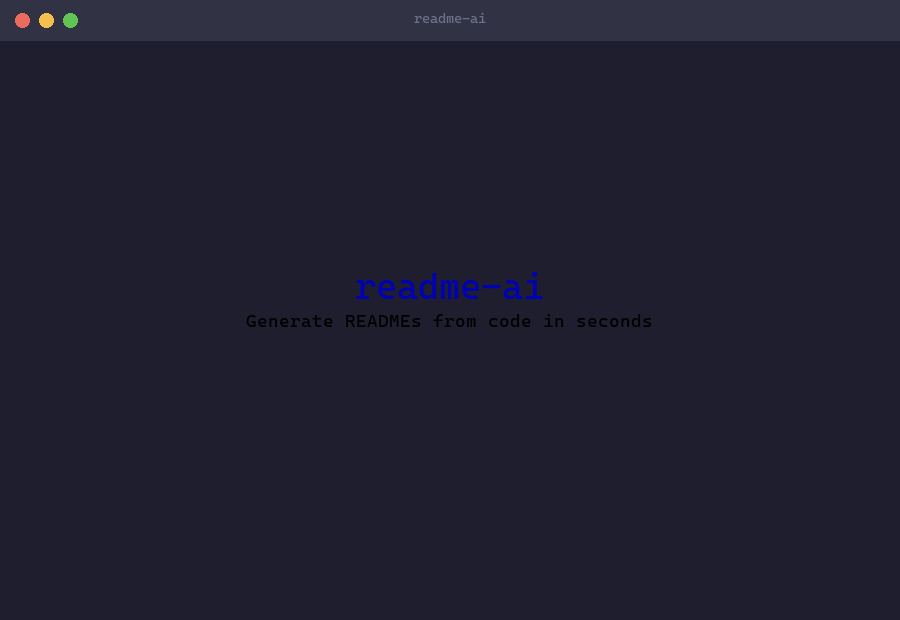
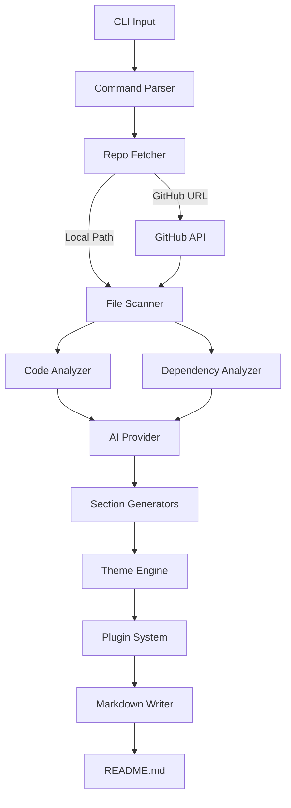

<div align="center">

# readme-ai

### The #1 AI-Powered README Generator for Developers

> Generate stunning, production-quality READMEs from any codebase in seconds — powered by Claude, GPT-4o, Gemini, or Ollama

[](https://www.npmjs.com/package/@malikasadjaved/readme-ai)
[](#)
[](#)
[](#license)
[](#)
[](#)
[](#contributing)

**One command. Zero install. Beautiful READMEs.**

```bash
npx @malikasadjaved/readme-ai
```

[Quick Start](#-quick-start) · [Themes](#-themes) · [AI Providers](#-ai-providers) · [Plugins](#-plugins) · [CLI Options](#-cli-options) · [GitHub Action](#-github-action) · [Contributing](#-contributing)

</div>

---

<!-- SEO: readme generator, ai readme, auto documentation, markdown generator, github readme, readme template, ai documentation tool, code documentation, auto readme, readme maker, project documentation, npx readme, readme-ai, claude readme, gpt readme, gemini readme, ollama readme, mermaid diagram generator, badge generator, open source documentation, developer tools 2026, best readme generator, ai developer tools, LLM documentation, automated documentation -->

## Overview

**readme-ai** is the most powerful open-source AI README generator available. It reads your actual source code — not just directory names — and generates a complete, polished README with architecture diagrams, badges, install instructions, usage examples, and API docs.

Point it at any local project or public GitHub repo and get a production-ready README in seconds.

### Why readme-ai?

- **Deep code analysis** — parses actual source files, not just file trees
- **10+ languages supported** — Node.js, Python, Rust, Go, Java (Gradle/Maven), Ruby, Swift, Dart/Flutter, and more
- **Mermaid architecture diagrams** — auto-generated from your code structure
- **Plugin system** — extend with custom analyzers and themes
- **Works with any AI** — Claude, GPT-4o, Gemini, or fully local with Ollama (free)
- **186 tests passing** — battle-tested and reliable

## Key Features

| Feature | Description |
|---------|-------------|
| **Zero Install** | `npx @malikasadjaved/readme-ai` — works instantly, no setup |
| **Deep Code Analysis** | Extracts functions, API endpoints, CLI commands, exports |
| **Auto Mermaid Diagrams** | Architecture diagrams generated from code structure |
| **5 Themes** | Default, Modern, Hacker, Minimal, Academic |
| **4 AI Providers** | Claude, GPT-4o, Gemini Flash, Ollama (local/free) |
| **Smart Badges** | Auto-detects language, frameworks, CI, Docker, license |
| **GitHub URL Support** | Analyze any public repo: `github:user/repo` |
| **GitHub Action** | Auto-regenerate README on every push |
| **Plugin System** | Custom analyzers and themes via plugins |
| **10+ Languages** | Node.js, Python, Rust, Go, Java, Ruby, Swift, Dart, and more |
| **Project Config** | `.readmeairc.json` or `readme-ai.config.js` |
| **API Docs** | Auto-generated from exported functions and classes |

## Quick Start

```bash
# Generate README for current directory
npx @malikasadjaved/readme-ai

# Point at a local project
npx @malikasadjaved/readme-ai ./my-project

# Point at a GitHub repo
npx @malikasadjaved/readme-ai github:expressjs/express

# Interactive mode (guided prompts)
npx @malikasadjaved/readme-ai --interactive
```

### Install globally (optional)

```bash
npm install -g @malikasadjaved/readme-ai
readme-ai ./my-project
```

## Demo

<div align="center">
  
  <p><em>Generating a full README in seconds — with architecture diagrams, badges, and more.</em></p>
</div>

## Comparison

| Feature | readme-ai | eli64s/readme-ai | readmeX |
|---------|:---------:|:----------------:|:-------:|
| npx support (zero install) | **Yes** | No | No |
| Mermaid architecture diagrams | **Yes** | No | No |
| Plugin system | **Yes** | No | No |
| GitHub URL analysis | **Yes** | Yes | Yes |
| Multiple themes | **5** | 3 | No |
| GitHub Action template | **Yes** | No | No |
| API docs from code | **Yes** | No | No |
| Badge auto-generation | **Yes** | Yes | Partial |
| Local AI (Ollama) | **Yes** | No | No |
| 10+ language support | **Yes** | Partial | No |
| Pre-commit hooks | **Yes** | No | No |

## Themes

### Default — Clean & Professional
The standard theme with a centered header, emoji section headers, and shields.io badges.

### Modern — Emoji-rich & Colorful
Heavy use of emojis, colorful badge rows, and visual separators for maximum impact.

### Hacker — Terminal Aesthetic
ASCII art header, monospace styling, `>` prefixed descriptions — for the terminal lovers.

### Minimal — Pure Markdown
No emojis, no badges, no frills. Just clean, readable markdown.

### Academic — Formal & Structured
Numbered sections, citation-style references, formal language. Great for research projects.

```bash
# Use a specific theme
npx @malikasadjaved/readme-ai --theme modern
npx @malikasadjaved/readme-ai --theme hacker
npx @malikasadjaved/readme-ai --theme minimal
npx @malikasadjaved/readme-ai --theme academic
```

> Want a custom theme? Use the [plugin system](#-plugins) to create your own!

## AI Providers

### Claude (Anthropic) — Default

```bash
export ANTHROPIC_API_KEY=sk-ant-...
npx @malikasadjaved/readme-ai
```

### GPT-4o-mini (OpenAI)

```bash
export OPENAI_API_KEY=sk-...
npx @malikasadjaved/readme-ai --provider openai
```

### Gemini Flash (Google)

```bash
export GEMINI_API_KEY=...
npx @malikasadjaved/readme-ai --provider gemini
```

### Ollama (Local, Free, Private)

```bash
# Make sure Ollama is running locally
npx @malikasadjaved/readme-ai --provider ollama
npx @malikasadjaved/readme-ai --provider ollama --model llama3.1
```

## CLI Options

```
Usage: readme-ai [repo] [options]

Arguments:
  repo                     Local path or GitHub URL (github:user/repo)

Options:
  -V, --version            Output the version number
  -o, --output <file>      Output file path (default: "README.md")
  -p, --provider <name>    AI provider: anthropic | openai | gemini | ollama (default: "anthropic")
  -m, --model <name>       Model name (depends on provider)
  -t, --theme <name>       Theme: default | minimal | hacker | modern | academic (default: "default")
  --no-diagram             Skip Mermaid architecture diagram
  --no-badges              Skip badge generation
  --no-api-docs            Skip API documentation section
  --interactive            Run in interactive mode
  --action                 Generate a GitHub Action for auto-updating README
  --overwrite              Overwrite existing README without asking
  --dry-run                Print README to stdout instead of writing to file
  -h, --help               Display help for command
```

### Examples

```bash
# Generate with Modern theme using OpenAI
npx @malikasadjaved/readme-ai ./my-app --provider openai --theme modern

# Dry run (preview without writing)
npx @malikasadjaved/readme-ai --dry-run

# Generate without diagram and badges
npx @malikasadjaved/readme-ai --no-diagram --no-badges

# Overwrite existing README and generate GitHub Action
npx @malikasadjaved/readme-ai --overwrite --action

# Analyze a remote GitHub repository
npx @malikasadjaved/readme-ai github:tiangolo/fastapi --theme academic
```

## Plugins

readme-ai supports a **plugin system** for custom analyzers and themes. Plugins can add extra README sections, badges, or entirely new visual themes.

```js
// readme-ai.config.js
export default {
  plugins: [
    './my-local-plugin.js',       // local plugin file
    'readme-ai-plugin-example',   // npm package
  ],
};
```

Packages named `readme-ai-plugin-*` in `node_modules` are auto-discovered. See [CONTRIBUTING.md](CONTRIBUTING.md#writing-plugins) for the full plugin authoring guide.

### Plugin Example

```ts
const myPlugin = {
  name: 'my-plugin',
  analyzers: [{
    name: 'security-scanner',
    analyze: async ({ scan, codeAnalysis, deps }) => ({
      sections: { 'Security': 'No vulnerabilities found.' },
      badges: [{ label: 'security', message: 'passing', color: 'green' }],
    }),
  }],
  themes: [{
    name: 'corporate',
    render: (data) => `# ${data.projectName}\n\n${data.description}`,
  }],
};
export default myPlugin;
```

## GitHub Action

Auto-regenerate your README on every push to main:

```bash
# Generate the action file automatically
npx @malikasadjaved/readme-ai --action
```

Or manually create `.github/workflows/readme-update.yml`:

```yaml
name: Update README

on:
  push:
    branches: [main, master]
    paths-ignore:
      - 'README.md'

jobs:
  update-readme:
    runs-on: ubuntu-latest
    permissions:
      contents: write

    steps:
      - uses: actions/checkout@v4

      - uses: actions/setup-node@v4
        with:
          node-version: '20'

      - name: Generate README
        run: npx @malikasadjaved/readme-ai@latest --overwrite --no-interactive
        env:
          ANTHROPIC_API_KEY: ${{ secrets.ANTHROPIC_API_KEY }}

      - name: Commit updated README
        uses: stefanzweifel/git-auto-commit-action@v5
        with:
          commit_message: 'docs: auto-update README [skip ci]'
          file_pattern: README.md
```

## Supported Languages

| Language | Package Manager | Install | Build | Test |
|----------|----------------|---------|-------|------|
| **Node.js** | npm / yarn / pnpm | `npm install` | `npm run build` | `npm test` |
| **Python** | pip / pyproject | `pip install -r requirements.txt` | — | `pytest` |
| **Rust** | cargo | `cargo build --release` | `cargo build` | `cargo test` |
| **Go** | go modules | `go mod download` | `go build` | `go test ./...` |
| **Java (Gradle)** | gradle | `gradle build` | `gradle build` | `gradle test` |
| **Java (Maven)** | maven | `mvn install` | `mvn package` | `mvn test` |
| **Ruby** | bundler | `bundle install` | — | `bundle exec rspec` |
| **Swift** | Swift PM | `swift package resolve` | `swift build` | `swift test` |
| **Dart/Flutter** | pub | `dart pub get` | `dart compile` | `dart test` |

## Architecture



## Project Structure

```
readme-ai/
├── src/
│   ├── index.ts              # CLI entry point
│   ├── cli.ts                # Interactive mode
│   ├── config.ts             # Configuration management
│   ├── commands/
│   │   └── generate.ts       # Main generation pipeline
│   ├── analyzers/
│   │   ├── repo-fetcher.ts   # Fetch from local or GitHub
│   │   ├── file-scanner.ts   # Scan and categorize files
│   │   ├── code-analyzer.ts  # Extract functions, endpoints, exports
│   │   ├── dependency-analyzer.ts  # 10+ language support
│   │   ├── badge-generator.ts
│   │   └── diagram-builder.ts
│   ├── generators/
│   │   ├── overview.ts       # Project summary + features
│   │   ├── install.ts        # Install instructions
│   │   ├── usage.ts          # Usage examples + API docs
│   │   ├── contributing.ts   # Contributing guide
│   │   └── changelog.ts      # Changelog section
│   ├── plugins/
│   │   └── index.ts          # Plugin loader and registry
│   ├── providers/
│   │   ├── anthropic.ts      # Claude
│   │   ├── openai.ts         # GPT-4o
│   │   ├── gemini.ts         # Gemini Flash
│   │   └── ollama.ts         # Local Ollama
│   ├── themes/
│   │   ├── default.ts
│   │   ├── modern.ts
│   │   ├── hacker.ts
│   │   ├── minimal.ts
│   │   └── academic.ts
│   └── utils/
│       ├── file-utils.ts
│       ├── github-api.ts
│       ├── language-detector.ts
│       ├── markdown-writer.ts
│       ├── template-engine.ts
│       └── cache.ts
├── tests/                    # 186 tests (Vitest)
├── CONTRIBUTING.md           # Full contributor guide
├── CHANGELOG.md
└── LICENSE
```

## Contributing

Contributions are welcome! See [CONTRIBUTING.md](CONTRIBUTING.md) for the full guide.

```bash
git clone https://github.com/malikasadjaved/readme-ai.git
cd readme-ai
npm install
npm test        # 186 tests
npm run dev     # development mode
```

Pre-commit hooks with Husky + lint-staged ensure code quality on every commit.

## Star History

If you find readme-ai useful, please give it a star! It helps others discover the project.

## License

[MIT](LICENSE) — use it freely in personal and commercial projects.

---

<div align="center">

**Built by [Malik Asad Javed](https://github.com/malikasadjaved)**

**[readme-ai](https://github.com/malikasadjaved/readme-ai)** — the best AI README generator for developers

<sub>readme generator | ai documentation | markdown generator | github readme | developer tools | claude | openai | gemini | ollama | mermaid diagrams | open source</sub>

</div>
