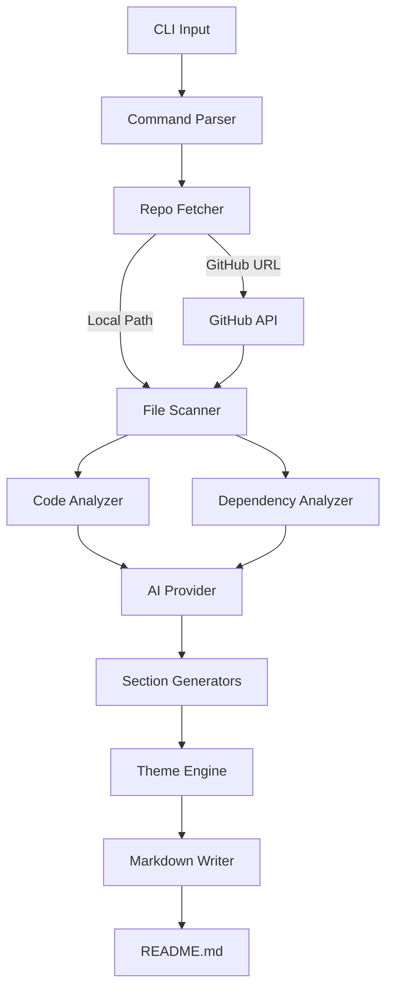

<div align="center">

# readme-ai

> Generate stunning, production-quality READMEs from any codebase in seconds

[](#)
[](#)
[](#license)
[](https://www.npmjs.com/package/@malikasadjaved/readme-ai)

**One command. Zero install. Beautiful READMEs.**

[Quick Start](#-quick-start) · [Themes](#-themes) · [Providers](#-ai-providers) · [CLI Options](#-cli-options) · [GitHub Action](#-github-action)

</div>

---

## Overview

**readme-ai** reads your actual source code — not just directory names — and generates a complete, polished README with architecture diagrams, badges, install instructions, usage examples, and API docs. Point it at any local project or public GitHub repo and get a production-ready README in seconds.

Unlike existing tools, readme-ai goes deep: it parses dependencies, detects frameworks, extracts API endpoints and CLI commands, and builds Mermaid architecture diagrams automatically. It supports 5 visual themes and 4 AI providers (including fully local generation via Ollama).

## Key Features

- **npx-first** — zero install, works instantly: `npx @malikasadjaved/readme-ai`
- **Deep code analysis** — reads actual source files, extracts functions, endpoints, and CLI commands
- **Auto Mermaid diagrams** — generates architecture diagrams from your code structure
- **5 beautiful themes** — Default, Modern, Hacker, Minimal, Academic
- **4 AI providers** — Claude, GPT-4o, Gemini, Ollama (free & local)
- **Smart badge generation** — auto-detects language, frameworks, CI, Docker, license
- **GitHub URL support** — `npx @malikasadjaved/readme-ai github:user/repo` analyzes any public repo
- **GitHub Action included** — auto-regenerate your README on every push

## Quick Start

```bash
# Generate README for current directory
npx @malikasadjaved/readme-ai

# Point at a local project
npx @malikasadjaved/readme-ai ./my-project

# Point at a GitHub repo
npx @malikasadjaved/readme-ai github:expressjs/express

# Interactive mode (guided prompts)
npx @malikasadjaved/readme-ai --interactive
```

## Comparison

| Feature | readme-ai | eli64s/readme-ai | readmeX |
|---------|:---------:|:----------------:|:-------:|
| npx support (zero install) | **Yes** | No | No |
| Mermaid architecture diagrams | **Yes** | No | No |
| GitHub URL analysis | **Yes** | Yes | Yes |
| Multiple themes | **5** | 3 | No |
| GitHub Action template | **Yes** | No | No |
| API docs from code | **Yes** | No | No |
| Badge auto-generation | **Yes** | Yes | Partial |
| Local AI (Ollama) | **Yes** | No | No |

## Themes

### Default — Clean & Professional
The standard theme with a centered header, emoji section headers, and shields.io badges.

### Modern — Emoji-rich & Colorful
Heavy use of emojis, colorful badge rows, and visual separators for maximum impact.

### Hacker — Terminal Aesthetic
ASCII art header, monospace styling, `>` prefixed descriptions — for the terminal lovers.

### Minimal — Pure Markdown
No emojis, no badges, no frills. Just clean, readable markdown.

### Academic — Formal & Structured
Numbered sections, citation-style references, formal language. Great for research projects.

```bash
# Use a specific theme
npx @malikasadjaved/readme-ai --theme modern
npx @malikasadjaved/readme-ai --theme hacker
npx @malikasadjaved/readme-ai --theme minimal
npx @malikasadjaved/readme-ai --theme academic
```

## AI Providers

### Claude (Anthropic) — Default

```bash
export ANTHROPIC_API_KEY=sk-ant-...
npx @malikasadjaved/readme-ai
```

### GPT-4o-mini (OpenAI)

```bash
export OPENAI_API_KEY=sk-...
npx @malikasadjaved/readme-ai --provider openai
```

### Gemini Flash (Google)

```bash
export GEMINI_API_KEY=...
npx @malikasadjaved/readme-ai --provider gemini
```

### Ollama (Local, Free)

```bash
# Make sure Ollama is running locally
npx @malikasadjaved/readme-ai --provider ollama
npx @malikasadjaved/readme-ai --provider ollama --model llama3.1
```

## CLI Options

```
Usage: readme-ai [repo] [options]

Arguments:
  repo                     Local path or GitHub URL (github:user/repo)

Options:
  -V, --version            Output the version number
  -o, --output <file>      Output file path (default: "README.md")
  -p, --provider <name>    AI provider: anthropic | openai | gemini | ollama (default: "anthropic")
  -m, --model <name>       Model name (depends on provider)
  -t, --theme <name>       Theme: default | minimal | hacker | modern | academic (default: "default")
  --no-diagram             Skip Mermaid architecture diagram
  --no-badges              Skip badge generation
  --no-api-docs            Skip API documentation section
  --interactive            Run in interactive mode
  --action                 Generate a GitHub Action for auto-updating README
  --overwrite              Overwrite existing README without asking
  --dry-run                Print README to stdout instead of writing to file
  -h, --help               Display help for command
```

### Examples

```bash
# Generate with Modern theme using OpenAI
npx @malikasadjaved/readme-ai ./my-app --provider openai --theme modern

# Dry run (preview without writing)
npx @malikasadjaved/readme-ai --dry-run

# Generate without diagram and badges
npx @malikasadjaved/readme-ai --no-diagram --no-badges

# Overwrite existing README and generate GitHub Action
npx @malikasadjaved/readme-ai --overwrite --action

# Analyze a remote GitHub repository
npx @malikasadjaved/readme-ai github:tiangolo/fastapi --theme academic
```

## GitHub Action

Auto-regenerate your README on every push to main:

```bash
# Generate the action file automatically
npx @malikasadjaved/readme-ai --action
```

Or manually create `.github/workflows/readme-update.yml`:

```yaml
name: Update README

on:
  push:
    branches: [main, master]
    paths-ignore:
      - 'README.md'

jobs:
  update-readme:
    runs-on: ubuntu-latest
    permissions:
      contents: write

    steps:
      - uses: actions/checkout@v4

      - uses: actions/setup-node@v4
        with:
          node-version: '20'

      - name: Generate README
        run: npx @malikasadjaved/readme-ai@latest --overwrite --no-interactive
        env:
          ANTHROPIC_API_KEY: ${{ secrets.ANTHROPIC_API_KEY }}

      - name: Commit updated README
        uses: stefanzweifel/git-auto-commit-action@v5
        with:
          commit_message: 'docs: auto-update README [skip ci]'
          file_pattern: README.md
```

## Architecture



## Project Structure

```
readme-ai/
├── src/
│   ├── index.ts              # CLI entry point
│   ├── cli.ts                # Interactive mode
│   ├── config.ts             # Configuration management
│   ├── commands/
│   │   └── generate.ts       # Main generation pipeline
│   ├── analyzers/
│   │   ├── repo-fetcher.ts   # Fetch from local or GitHub
│   │   ├── file-scanner.ts   # Scan and categorize files
│   │   ├── code-analyzer.ts  # Extract functions, endpoints, exports
│   │   ├── dependency-analyzer.ts
│   │   ├── badge-generator.ts
│   │   └── diagram-builder.ts
│   ├── generators/
│   │   ├── overview.ts       # Project summary + features
│   │   ├── install.ts        # Install instructions
│   │   ├── usage.ts          # Usage examples + API docs
│   │   ├── contributing.ts   # Contributing guide
│   │   └── changelog.ts      # Changelog section
│   ├── providers/
│   │   ├── anthropic.ts      # Claude
│   │   ├── openai.ts         # GPT-4o
│   │   ├── gemini.ts         # Gemini Flash
│   │   └── ollama.ts         # Local Ollama
│   ├── themes/
│   │   ├── default.ts
│   │   ├── modern.ts
│   │   ├── hacker.ts
│   │   ├── minimal.ts
│   │   └── academic.ts
│   └── utils/
│       ├── file-utils.ts
│       ├── github-api.ts
│       ├── language-detector.ts
│       ├── markdown-writer.ts
│       └── template-engine.ts
├── templates/
│   ├── github-action.yml
│   └── .readmeaiignore.example
└── tests/
    ├── analyzers/
    └── generators/
```

## Contributing

Contributions are welcome! Here's how to get started:

```bash
# Clone the repo
git clone https://github.com/malikasadjaved/readme-ai.git
cd readme-ai

# Install dependencies
npm install

# Run in development mode
npm run dev

# Run tests
npm test

# Build
npm run build
```

## License

[MIT](LICENSE)

---

<div align="center">

Built with readme-ai

</div>
