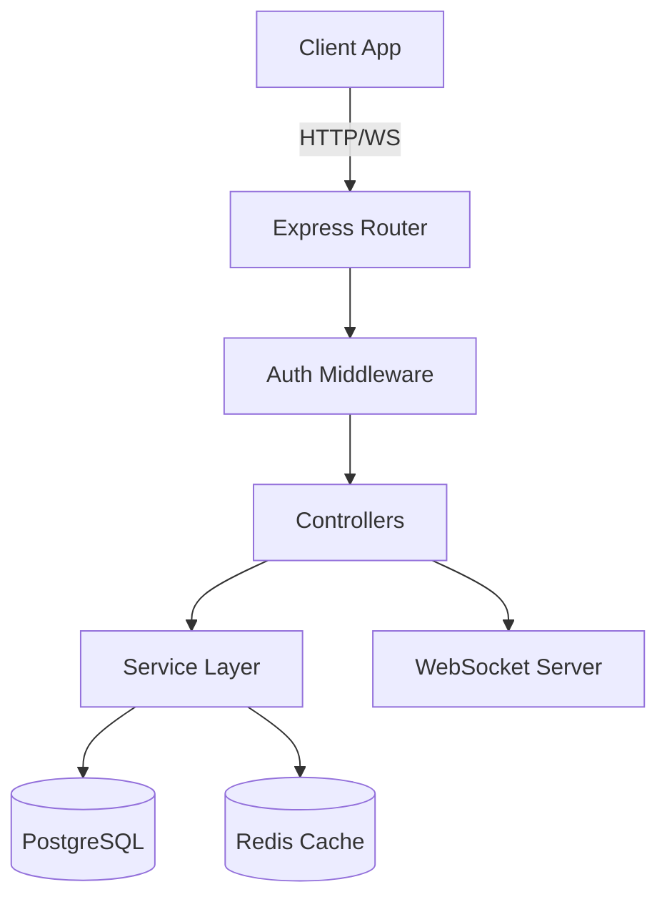

# `readme-ai` — Complete Claude Code Implementation Spec
> Feed this entire document to Claude Code as your first message. It is a complete, self-contained build plan.

---

## 🎯 PROJECT OVERVIEW

**Name:** `readme-ai`  
**npm package:** `readme-ai` (published to npm)  
**Repository:** `readme-ai` (public GitHub repo)  
**Tagline:** _Generate stunning, production-quality READMEs from any codebase in seconds._  
**Language:** TypeScript (Node.js ≥18)  
**Core command:** `npx readme-ai` (zero install needed)

### What makes this DIFFERENT from existing tools (eli64s/readme-ai, readmeX, readmecodegen):
1. **npx-first** — zero install, works instantly: `npx readme-ai --repo ./my-project`
2. **Deep code analysis** — reads actual source files, not just directory structure
3. **Auto Mermaid diagrams** — generates architecture diagram of the project automatically
4. **Multi-theme output** — 5 beautiful README themes with different visual styles
5. **GitHub Action included** — auto-regenerates README on every push
6. **API docs from code** — extracts function signatures and generates API reference
7. **Badge auto-generation** — detects CI, coverage, license, package manager and adds shields.io badges
8. **Works on URLs** — point at any public GitHub repo: `npx readme-ai --repo github:username/repo`

---

## 📁 COMPLETE PROJECT STRUCTURE

```
readme-ai/
├── package.json
├── tsconfig.json
├── .eslintrc.json
├── README.md                        ← (generated by the tool itself — meta showcase)
├── LICENSE                          ← MIT
├── .github/
│   └── workflows/
│       ├── release.yml              ← auto-publish to npm on tag
│       └── readme-update.yml        ← example GitHub Action for users to copy
├── src/
│   ├── index.ts                     ← CLI entry point (commander)
│   ├── cli.ts                       ← argument parsing + interactive prompts
│   ├── commands/
│   │   └── generate.ts              ← main generation pipeline
│   ├── analyzers/
│   │   ├── index.ts                 ← orchestrates all analyzers
│   │   ├── repo-fetcher.ts          ← fetch from local path or GitHub URL
│   │   ├── file-scanner.ts          ← recursively scan and categorize files
│   │   ├── code-analyzer.ts         ← extract functions, classes, exports from source
│   │   ├── dependency-analyzer.ts   ← parse package.json, requirements.txt, etc.
│   │   ├── badge-generator.ts       ← detect and generate shields.io badges
│   │   └── diagram-builder.ts       ← generate Mermaid architecture diagram
│   ├── generators/
│   │   ├── index.ts                 ← orchestrates section generation
│   │   ├── overview.ts              ← project summary + key features
│   │   ├── install.ts               ← installation instructions
│   │   ├── usage.ts                 ← usage examples + API reference
│   │   ├── contributing.ts          ← contributing guide
│   │   └── changelog.ts             ← changelog section
│   ├── providers/
│   │   ├── index.ts                 ← provider factory
│   │   ├── anthropic.ts             ← Claude
│   │   ├── openai.ts                ← OpenAI
│   │   ├── gemini.ts                ← Google Gemini
│   │   └── ollama.ts                ← Local Ollama
│   ├── themes/
│   │   ├── index.ts                 ← theme registry
│   │   ├── default.ts               ← clean professional theme
│   │   ├── minimal.ts               ← ultra minimal (no emojis, no badges)
│   │   ├── hacker.ts                ← dark/terminal aesthetic with ASCII
│   │   ├── modern.ts                ← emoji-heavy, colorful badges
│   │   └── academic.ts              ← formal, citation-style
│   ├── config.ts                    ← config management
│   └── utils/
│       ├── file-utils.ts            ← file reading, filtering, tree generation
│       ├── github-api.ts            ← GitHub API wrapper (stars, topics, license)
│       ├── language-detector.ts     ← detect primary language + secondary languages
│       ├── markdown-writer.ts       ← write/format final markdown
│       └── template-engine.ts       ← fill README templates with generated content
├── templates/
│   ├── github-action.yml            ← template for user's auto-update action
│   └── .readmeaiignore.example      ← example ignore file
└── tests/
    ├── analyzers/
    │   ├── file-scanner.test.ts
    │   ├── badge-generator.test.ts
    │   └── diagram-builder.test.ts
    └── generators/
        └── overview.test.ts
```

---

## 📦 package.json

```json
{
  "name": "readme-ai",
  "version": "1.0.0",
  "description": "Generate stunning, production-quality READMEs from any codebase in seconds",
  "keywords": ["readme", "documentation", "ai", "generator", "markdown", "github", "claude", "openai", "mermaid", "developer-tools"],
  "homepage": "https://github.com/YOUR_USERNAME/readme-ai",
  "repository": { "type": "git", "url": "https://github.com/YOUR_USERNAME/readme-ai" },
  "license": "MIT",
  "bin": { "readme-ai": "./dist/index.js" },
  "main": "./dist/index.js",
  "files": ["dist", "templates"],
  "scripts": {
    "build": "tsc && chmod +x dist/index.js",
    "dev": "ts-node src/index.ts",
    "test": "vitest run",
    "release": "npm run build && npm publish"
  },
  "dependencies": {
    "@anthropic-ai/sdk": "^0.28.0",
    "@google/generative-ai": "^0.19.0",
    "@inquirer/prompts": "^6.0.0",
    "@octokit/rest": "^21.0.0",
    "chalk": "^5.3.0",
    "commander": "^12.0.0",
    "conf": "^13.0.0",
    "fast-glob": "^3.3.2",
    "openai": "^4.57.0",
    "ora": "^8.1.0",
    "simple-git": "^3.27.0",
    "update-notifier": "^7.0.0"
  },
  "devDependencies": {
    "@types/node": "^22.0.0",
    "typescript": "^5.5.0",
    "vitest": "^2.0.0"
  },
  "engines": { "node": ">=18" }
}
```

---

## 🔧 src/index.ts — CLI Entry Point

```typescript
#!/usr/bin/env node
import { Command } from 'commander';
import updateNotifier from 'update-notifier';
import pkg from '../package.json' assert { type: 'json' };
import { runGenerate } from './commands/generate.js';
import { runCLI } from './cli.js';

updateNotifier({ pkg }).notify();

const program = new Command();

program
  .name('readme-ai')
  .description('Generate production-quality READMEs from any codebase')
  .version(pkg.version)
  .argument('[repo]', 'Local path or GitHub URL (github:user/repo or https://github.com/...)')
  .option('-o, --output <file>', 'Output file path', 'README.md')
  .option('-p, --provider <name>', 'AI provider: anthropic | openai | gemini | ollama', 'anthropic')
  .option('-m, --model <name>', 'Model name (depends on provider)')
  .option('-t, --theme <name>', 'README theme: default | minimal | hacker | modern | academic', 'default')
  .option('--no-diagram', 'Skip Mermaid architecture diagram')
  .option('--no-badges', 'Skip badge generation')
  .option('--no-api-docs', 'Skip API documentation section')
  .option('--interactive', 'Run in interactive mode (asks questions about your project)')
  .option('--action', 'Also generate a GitHub Action for auto-updating README')
  .option('--overwrite', 'Overwrite existing README without asking')
  .option('--dry-run', 'Print README to stdout instead of writing to file')
  .action(async (repo, opts) => {
    // If no repo provided and not in a git repo, run interactive setup
    if (!repo && opts.interactive) {
      await runCLI();
    } else {
      await runGenerate({ repo: repo || '.', ...opts });
    }
  });

program.parse();
```

---

## 🖥️ src/cli.ts — Interactive CLI Mode

When run with no arguments or `--interactive`, guide the user:

```typescript
export async function runCLI() {
  console.log(chalk.cyan.bold('\n✨ readme-ai — Let\'s generate your README\n'));
  
  // Step 1: Repo path
  const repoPath = await input({
    message: 'Path to your project (or GitHub URL):',
    default: '.'
  });
  
  // Step 2: Provider
  const provider = await select({
    message: 'Choose your AI provider:',
    choices: [
      { name: '🟣 Claude (Anthropic) — Recommended', value: 'anthropic' },
      { name: '🟢 GPT-4o-mini (OpenAI)', value: 'openai' },
      { name: '🔵 Gemini Flash (Google)', value: 'gemini' },
      { name: '⚪ Ollama (100% local, free)', value: 'ollama' },
    ]
  });
  
  // Step 3: Theme
  const theme = await select({
    message: 'Choose README theme:',
    choices: [
      { name: '📄 Default — Clean & professional', value: 'default' },
      { name: '⚡ Modern — Emoji-rich with colorful badges', value: 'modern' },
      { name: '🖤 Hacker — Terminal/dark ASCII aesthetic', value: 'hacker' },
      { name: '🪶 Minimal — No emojis, pure markdown', value: 'minimal' },
      { name: '🎓 Academic — Formal, citation style', value: 'academic' },
    ]
  });
  
  // Step 4: Options
  const options = await checkbox({
    message: 'What to include:',
    choices: [
      { name: '🏗️  Architecture diagram (Mermaid)', value: 'diagram', checked: true },
      { name: '🏷️  Auto-generated badges', value: 'badges', checked: true },
      { name: '📚 API documentation', value: 'apiDocs', checked: true },
      { name: '🔄 GitHub Action for auto-updates', value: 'action', checked: false },
    ]
  });
  
  // Step 5: Additional context (optional)
  const context = await input({
    message: 'Any additional context for the AI? (optional):',
    default: ''
  });
  
  await runGenerate({ repo: repoPath, provider, theme, context, ...optionsMap });
}
```

---

## 🔬 src/analyzers/repo-fetcher.ts — Fetch Repo Content

```typescript
export interface RepoContent {
  path: string;           // root path or temp dir for GitHub repos
  isRemote: boolean;      // true if fetched from GitHub
  files: FileEntry[];     // all files (filtered)
  packageJson?: object;   // parsed package.json if found
  pythonRequirements?: string;
  cargoToml?: object;
  goMod?: string;
  githubMeta?: GitHubMeta; // stars, topics, description from GitHub API
}

export interface FileEntry {
  path: string;           // relative path from repo root
  absolutePath: string;
  language: string;       // 'typescript' | 'python' | 'rust' | etc.
  size: number;           // bytes
  isEntryPoint: boolean;  // index.ts, main.py, app.py, main.go, etc.
  isConfig: boolean;      // package.json, tsconfig, etc.
  isTest: boolean;
}

// Accepts:
// - '.' or '/absolute/path' (local)
// - 'github:username/repo'
// - 'https://github.com/username/repo'
// - 'https://github.com/username/repo/tree/branch'

export async function fetchRepo(input: string): Promise<RepoContent>

// For GitHub repos: use @octokit/rest to clone-less fetch file tree + key files
// Download only: package.json, main entry files, src/ files (up to 100 files)
// Do NOT download: node_modules, dist, .git, assets, images
```

---

## 🔍 src/analyzers/file-scanner.ts — File System Analysis

```typescript
export interface ScanResult {
  totalFiles: number;
  languages: LanguageStat[];     // sorted by line count
  frameworks: string[];          // detected: React, FastAPI, Django, Express, etc.
  hasTests: boolean;
  hasDocker: boolean;
  hasCICD: boolean;              // .github/workflows, .gitlab-ci.yml, etc.
  hasLicense: string | null;     // license type
  entryPoints: string[];         // main files
  configFiles: string[];         // tsconfig, pyproject.toml, etc.
  directoryTree: string;         // formatted tree string (max 3 levels deep)
  keyFiles: FileEntry[];         // most important files for AI to read
}

export interface LanguageStat {
  name: string;
  files: number;
  percentage: number;
  icon: string;   // emoji: 🦕 TypeScript, 🐍 Python, 🦀 Rust, etc.
}

// Respects .readmeaiignore file (same syntax as .gitignore)
// Default ignores: node_modules, dist, build, .git, coverage, *.lock files
// Frameworks detected by checking: dependencies in package.json, imports in source files

export async function scanFiles(repoContent: RepoContent): Promise<ScanResult>

// Generate a beautiful directory tree like:
// src/
// ├── api/
// │   ├── routes.ts
// │   └── middleware.ts
// ├── db/
// │   └── schema.ts
// └── index.ts
export function generateTree(files: FileEntry[], maxDepth: number = 3): string
```

---

## 🔍 src/analyzers/code-analyzer.ts — Deep Code Analysis

This reads actual source files to extract meaningful information:

```typescript
export interface CodeAnalysis {
  exports: ExportInfo[];          // exported functions, classes, types
  mainFunctions: FunctionInfo[];  // key functions from entry points
  apiEndpoints: Endpoint[];       // REST endpoints (Express, FastAPI, etc.)
  cliCommands: CLICommand[];      // commander/argparse commands
  envVariables: string[];         // required env vars found in code
  externalDependencies: string[]; // key imports used
}

export interface FunctionInfo {
  name: string;
  signature: string;    // function name + params + return type
  description: string;  // extracted from JSDoc/docstring or AI-generated
  file: string;
}

export interface Endpoint {
  method: string;   // GET, POST, etc.
  path: string;     // /api/users/:id
  handler: string;  // function name
  file: string;
}

// Extraction strategy:
// TypeScript/JS: regex-based extraction of exports, function signatures, JSDoc
// Python: extract def/class with docstrings
// Look for patterns like: router.get('/path', handler), app.post('/path', handler)
// Extract process.env.VARIABLE_NAME patterns for env vars

export async function analyzeCode(keyFiles: FileEntry[]): Promise<CodeAnalysis>
```

---

## 📦 src/analyzers/dependency-analyzer.ts — Dependency Analysis

```typescript
export interface DependencyAnalysis {
  packageManager: 'npm' | 'yarn' | 'pnpm' | 'pip' | 'cargo' | 'go' | null;
  installCommand: string;     // "npm install" or "pip install -r requirements.txt" etc.
  runCommand: string;         // "npm start" or "python main.py" etc.
  buildCommand?: string;      // "npm run build" if exists
  testCommand?: string;       // "npm test" or "pytest" etc.
  mainDependencies: string[]; // top 10 production dependencies (no devDeps)
  devDependencies: string[];  // top 5 dev dependencies
  pythonVersion?: string;     // from .python-version or pyproject.toml
  nodeVersion?: string;       // from .nvmrc or engines field
  requiresDatabase: boolean;  // detected: postgres, mysql, mongodb, redis
  requiresEnvFile: boolean;   // uses dotenv or similar
}

// Supports: package.json, requirements.txt, Pipfile, pyproject.toml, 
//           Cargo.toml, go.mod, Gemfile, pom.xml, build.gradle

export async function analyzeDependencies(repoContent: RepoContent): Promise<DependencyAnalysis>
```

---

## 🏷️ src/analyzers/badge-generator.ts — Smart Badge Generation

```typescript
export interface Badge {
  label: string;
  url: string;           // shields.io URL
  markdown: string;      //  ready to paste
  category: 'language' | 'framework' | 'tool' | 'status' | 'meta';
}

// Badges to generate (based on what's detected):
// - Language badges: TypeScript, Python, Rust, Go
// - Framework badges: React, Next.js, FastAPI, Express, Django
// - Package manager: npm, pip, cargo
// - CI: GitHub Actions, GitLab CI
// - License: from package.json/LICENSE file
// - Node.js version: from engines field
// - npm version/downloads: if published to npm
// - Coverage: if codecov/coveralls config found
// - Docker: if Dockerfile found

// All badges use shields.io with consistent style:
// https://img.shields.io/badge/{label}-{message}-{color}?style=flat-square&logo={logo}

export function generateBadges(scan: ScanResult, deps: DependencyAnalysis, githubMeta?: GitHubMeta): Badge[]

// Returns pre-formatted badge rows for top of README:
// [](#) [](#) [](#)
export function formatBadgeRow(badges: Badge[]): string
```

---

## 🏗️ src/analyzers/diagram-builder.ts — Mermaid Architecture Diagrams

This is the MOST IMPRESSIVE DIFFERENTIATOR — auto-generate architecture diagrams:

```typescript
export interface DiagramResult {
  type: 'flowchart' | 'graph' | 'sequence';
  mermaidCode: string;
  description: string;  // human-readable explanation of the diagram
}

// Strategies based on project type:
// 
// CLI tools → flowchart showing command → processing → output
// Web APIs → graph showing: Client → API Routes → Controllers → DB
// React apps → component hierarchy or page flow
// Full-stack → shows frontend, backend, database layers
// Multi-package monorepo → package relationship graph
//
// Example output for a REST API:
// ```mermaid
// graph TD
//   A[Client] -->|HTTP Request| B[API Gateway]
//   B --> C[Auth Middleware]
//   C --> D[Route Handlers]
//   D --> E[Service Layer]
//   E --> F[(PostgreSQL)]
//   E --> G[(Redis Cache)]
//   D --> H[External APIs]
// ```

export async function buildDiagram(
  scan: ScanResult,
  codeAnalysis: CodeAnalysis,
  deps: DependencyAnalysis,
  provider: AIProvider
): Promise<DiagramResult>

// For simple projects: build diagram from file structure (no AI call needed)
// For complex projects: describe structure to AI and ask it to generate Mermaid
```

---

## 🎨 src/generators/overview.ts — AI-Powered Overview Generation

This is where the AI does the heavy lifting:

```typescript
export interface OverviewResult {
  tagline: string;           // one-line description (for top of README)
  description: string;       // 2-3 paragraph project description
  keyFeatures: string[];     // 5-7 bullet points
  useCases: string[];        // 3 use case examples
  targetAudience: string;    // "developers who..." 
}

export async function generateOverview(params: {
  scan: ScanResult;
  deps: DependencyAnalysis;
  codeAnalysis: CodeAnalysis;
  existingDescription?: string;  // from package.json description or GitHub
  userContext?: string;           // extra context provided by user
  provider: AIProvider;
}): Promise<OverviewResult>

// Prompt:
// Analyze this codebase and generate a README overview.
//
// PROJECT INFO:
// - Primary language: {language}
// - Frameworks: {frameworks}
// - Dependencies: {mainDeps}
// - Entry points: {entryPoints}
// - Has tests: {hasTests}, Has Docker: {hasDocker}, Has CI/CD: {hasCICD}
//
// CODE STRUCTURE:
// {directoryTree}
//
// KEY CODE PATTERNS DETECTED:
// {apiEndpoints}
// {cliCommands}
// {exports}
//
// USER-PROVIDED CONTEXT: {userContext}
// EXISTING DESCRIPTION: {existingDescription}
//
// Generate in JSON format:
// { "tagline": "...", "description": "...", "keyFeatures": [...], "useCases": [...], "targetAudience": "..." }
```

---

## 📦 src/generators/install.ts — Installation Instructions

```typescript
export interface InstallResult {
  prerequisites: string[];           // Node.js 18+, Python 3.9+, etc.
  installSteps: InstallStep[];       // numbered steps
  envSetupSteps?: InstallStep[];     // .env setup if needed
  verifyCommand?: string;            // command to verify install worked
}

// Generate based on detected package manager and dependencies:
// npm projects: npm install + npm start
// Python: pip install -r requirements.txt OR pip install package
// Docker available: also show Docker instructions
// .env required: show .env.example setup
// Database detected: show database setup steps

export function generateInstallSection(deps: DependencyAnalysis, scan: ScanResult): InstallResult
```

---

## 🎨 src/themes/default.ts — README Theme

Each theme is a template function that assembles the final README:

```typescript
export interface ThemeData {
  projectName: string;
  tagline: string;
  badgeRow: string;
  description: string;
  diagram: DiagramResult | null;
  keyFeatures: string[];
  useCases: string[];
  installSection: InstallResult;
  usageSection: UsageResult;
  apiDocs: APIDocsResult | null;
  contributingSection: string;
  license: string;
  directoryTree: string;
}

export function renderDefault(data: ThemeData): string {
  return `
<div align="center">

# ${data.projectName}

> ${data.tagline}

${data.badgeRow}

</div>

---

## 📖 Overview

${data.description}

## ✨ Features

${data.keyFeatures.map(f => `- ${f}`).join('\n')}

## 🏗️ Architecture

${data.diagram ? '```mermaid\n' + data.diagram.mermaidCode + '\n```' : ''}

${data.diagram?.description || ''}

## 📁 Project Structure

\`\`\`
${data.directoryTree}
\`\`\`

## 🚀 Getting Started

### Prerequisites

${data.installSection.prerequisites.map(p => `- ${p}`).join('\n')}

### Installation

${data.installSection.installSteps.map((s, i) => `${i + 1}. ${s.title}\n   \`\`\`bash\n   ${s.command}\n   \`\`\``).join('\n\n')}

## 💡 Usage

${data.usageSection.examples.map(e => `\`\`\`${e.language}\n${e.code}\n\`\`\``).join('\n\n')}

${data.apiDocs ? '## 📚 API Reference\n\n' + renderApiDocs(data.apiDocs) : ''}

## 🤝 Contributing

${data.contributingSection}

## 📄 License

${data.license}
`.trim();
}
```

Implement all 5 themes: `default`, `minimal`, `hacker`, `modern`, `academic`

**Hacker theme** uses ASCII art headers:
```
╔═══════════════════════════════════╗
║  readme-ai v1.0.0                 ║
║  AI-powered README generator      ║
╚═══════════════════════════════════╝
```

**Modern theme** uses more emojis, colorful badge groupings, shields with colors matched to language.

**Academic theme** uses formal structure: Abstract, Introduction, Methods, Results, References.

---

## 🔄 src/commands/generate.ts — Main Generation Pipeline

```typescript
export async function runGenerate(opts: GenerateOptions) {
  const spinner = ora();
  
  // ─── PHASE 1: FETCH ──────────────────────────────────────────────
  spinner.start('Fetching repository...');
  const repoContent = await fetchRepo(opts.repo);
  spinner.succeed(`Repository loaded: ${repoContent.files.length} files`);
  
  // ─── PHASE 2: ANALYZE ────────────────────────────────────────────
  spinner.start('Scanning file structure...');
  const scan = await scanFiles(repoContent);
  spinner.succeed(`Detected: ${scan.languages[0].name} project with ${scan.frameworks.join(', ')}`);
  
  spinner.start('Analyzing code...');
  const codeAnalysis = await analyzeCode(scan.keyFiles);
  spinner.succeed(`Found ${codeAnalysis.apiEndpoints.length} endpoints, ${codeAnalysis.mainFunctions.length} key functions`);
  
  spinner.start('Analyzing dependencies...');
  const deps = await analyzeDependencies(repoContent);
  spinner.succeed(`Package manager: ${deps.packageManager}`);
  
  // ─── PHASE 3: GENERATE WITH AI ───────────────────────────────────
  const provider = createProvider(opts.provider, opts.model);
  
  spinner.start('Generating project overview with AI...');
  const overview = await generateOverview({ scan, deps, codeAnalysis, provider, userContext: opts.context });
  spinner.succeed('Overview generated');
  
  if (opts.diagram !== false) {
    spinner.start('Building architecture diagram...');
    const diagram = await buildDiagram(scan, codeAnalysis, deps, provider);
    spinner.succeed('Architecture diagram created');
  }
  
  spinner.start('Generating installation instructions...');
  const installSection = generateInstallSection(deps, scan);
  spinner.succeed('Installation section ready');
  
  spinner.start('Generating usage examples with AI...');
  const usageSection = await generateUsageSection({ codeAnalysis, scan, provider });
  spinner.succeed('Usage examples generated');
  
  if (opts.apiDocs !== false && codeAnalysis.exports.length > 0) {
    spinner.start('Generating API documentation...');
    const apiDocs = await generateAPIDocs({ codeAnalysis, provider });
    spinner.succeed(`API docs generated for ${codeAnalysis.exports.length} exports`);
  }
  
  // ─── PHASE 4: RENDER ─────────────────────────────────────────────
  spinner.start('Generating badges...');
  const badges = generateBadges(scan, deps, repoContent.githubMeta);
  spinner.succeed(`${badges.length} badges generated`);
  
  spinner.start(`Rendering ${opts.theme} theme...`);
  const theme = getTheme(opts.theme);
  const readme = theme.render({
    projectName: getProjectName(repoContent),
    tagline: overview.tagline,
    badgeRow: formatBadgeRow(badges),
    description: overview.description,
    diagram: diagram || null,
    keyFeatures: overview.keyFeatures,
    useCases: overview.useCases,
    installSection,
    usageSection,
    apiDocs: apiDocs || null,
    contributingSection: generateContributing(scan),
    license: getLicense(scan),
    directoryTree: scan.directoryTree,
  });
  spinner.succeed('README rendered');
  
  // ─── PHASE 5: OUTPUT ─────────────────────────────────────────────
  if (opts.dryRun) {
    console.log('\n' + readme);
    return;
  }
  
  // Check if README.md exists and ask to overwrite
  const outputPath = path.join(repoContent.path, opts.output);
  if (fs.existsSync(outputPath) && !opts.overwrite) {
    const shouldOverwrite = await confirm({ message: `${opts.output} already exists. Overwrite?` });
    if (!shouldOverwrite) return;
  }
  
  await fs.writeFile(outputPath, readme, 'utf-8');
  
  // Show success summary
  console.log(`
${chalk.green('✓')} README generated successfully!

${chalk.bold('Output:')} ${outputPath}
${chalk.bold('Theme:')} ${opts.theme}
${chalk.bold('Sections:')} Overview, Features, Architecture, Installation, Usage${apiDocs ? ', API Docs' : ''}, Contributing

${chalk.dim('Preview your README at: https://markdownlivepreview.com')}
`);

  // Optionally generate GitHub Action
  if (opts.action) {
    await generateGitHubAction(repoContent.path);
    console.log(`${chalk.green('✓')} GitHub Action created: .github/workflows/readme-update.yml`);
  }
}
```

---

## 🔄 GitHub Action Template — templates/github-action.yml

```yaml
# .github/workflows/readme-update.yml
# Generated by readme-ai — https://github.com/YOUR_USERNAME/readme-ai
# This action auto-regenerates your README on every push to main

name: Update README

on:
  push:
    branches: [main, master]
    paths-ignore:
      - 'README.md'

jobs:
  update-readme:
    runs-on: ubuntu-latest
    permissions:
      contents: write
    
    steps:
      - uses: actions/checkout@v4
      
      - uses: actions/setup-node@v4
        with:
          node-version: '20'
      
      - name: Generate README
        run: npx readme-ai@latest --overwrite --no-interactive
        env:
          ANTHROPIC_API_KEY: ${{ secrets.ANTHROPIC_API_KEY }}
      
      - name: Commit updated README
        uses: stefanzweifel/git-auto-commit-action@v5
        with:
          commit_message: 'docs: auto-update README [skip ci]'
          file_pattern: README.md
```

---

## 🧪 SAMPLE OUTPUT (What the tool generates)

For a TypeScript REST API project, the generated README should look like:

```markdown
<div align="center">

# task-api

> A high-performance REST API for task management built with FastAPI and PostgreSQL

[](#)
[](#)
[](#)
[](#)

</div>

---

## 📖 Overview

task-api is a production-ready REST API for managing tasks, projects, and team assignments. Built with Express.js and TypeScript, it features JWT authentication, role-based access control, and real-time notifications via WebSockets.

Designed for teams needing a self-hosted task management backend...

## ✨ Features

- 🔐 JWT authentication with refresh token rotation
- 👥 Role-based access control (Admin, Manager, Member)
- ⚡ Real-time updates via WebSocket
- 📊 Built-in analytics and reporting
- 🐳 Docker-ready with multi-stage builds
- 📝 OpenAPI/Swagger documentation

## 🏗️ Architecture



The API follows a layered architecture...
```

---

## 🎯 UX DETAILS — Critical for Viral Success

### Terminal Output (must be beautiful):

```
✨ readme-ai v1.0.0

✓ Repository loaded: 47 files
✓ Detected: TypeScript project with Express, Prisma
✓ Found 12 endpoints, 8 key functions
✓ Package manager: npm

⠋ Generating project overview with AI...
✓ Overview generated

⠋ Building architecture diagram...
✓ Architecture diagram created (flowchart, 8 nodes)

⠋ Generating usage examples...
✓ 3 examples generated

⠋ Generating badges...
✓ 6 badges generated

⠋ Rendering default theme...
✓ README rendered (2,847 words)

━━━━━━━━━━━━━━━━━━━━━━━━━━━━━━━━━━━━━━

✓ README.md generated successfully!

  Output:  ./README.md
  Theme:   default  
  Size:    4.2 KB
  Tokens:  ~1,850 (cost: ~$0.003)
  Time:    8.4 seconds

  Preview: https://markdownlivepreview.com
  
━━━━━━━━━━━━━━━━━━━━━━━━━━━━━━━━━━━━━━
```

### Error messages:

```
✗ No source files found in ./my-project
  Make sure the path contains code files (not just config files)

✗ GitHub API rate limit exceeded
  Set GITHUB_TOKEN for higher limits: export GITHUB_TOKEN=your_token

✗ ANTHROPIC_API_KEY not set
  Export your key: export ANTHROPIC_API_KEY=sk-ant-...
  Or use Ollama for free: --provider ollama
```

---

## ⚙️ src/config.ts — Config Management

```typescript
import Conf from 'conf';

interface ReadmeAIConfig {
  provider: 'anthropic' | 'openai' | 'gemini' | 'ollama';
  model?: string;
  anthropic_api_key?: string;
  openai_api_key?: string;
  gemini_api_key?: string;
  ollama_url?: string;
  github_token?: string;
  default_theme?: string;
  default_output?: string;
}

export const config = new Conf<ReadmeAIConfig>({ projectName: 'readme-ai' });
```

Also read from environment variables (takes priority over config):
- `ANTHROPIC_API_KEY`
- `OPENAI_API_KEY`
- `GEMINI_API_KEY`
- `GITHUB_TOKEN`
- `OLLAMA_BASE_URL`

---

## 📋 README.md Requirements (This Tool Generates Its Own README)

The project's own README.md should be generated by running `npx readme-ai` on itself. It must include:

1. **Hero badge row** — language, version, license, downloads
2. **Demo GIF placeholder** with a real terminal recording description
3. **Quick start** — one-liner `npx readme-ai` command
4. **Comparison table** vs existing tools:
   | Feature | readme-ai | eli64s/readme-ai | readmeX |
   |---------|-----------|-----------------|---------|
   | npx support | ✅ | ❌ | ❌ |
   | Mermaid diagrams | ✅ | ❌ | ❌ |
   | GitHub URL | ✅ | ✅ | ✅ |
   | Multiple themes | ✅ (5) | ✅ (3) | ❌ |
   | GitHub Action | ✅ | ❌ | ❌ |
5. **All CLI options** documented
6. **Theme showcase** — screenshots of all 5 themes
7. **Provider setup** for all 4 providers
8. **GitHub Action** setup section

---

## ✅ IMPLEMENTATION ORDER FOR CLAUDE CODE

Build in this exact order:

1. `package.json`, `tsconfig.json`
2. `src/config.ts`
3. `src/utils/file-utils.ts`
4. `src/utils/github-api.ts`
5. `src/utils/language-detector.ts`
6. `src/analyzers/repo-fetcher.ts`
7. `src/analyzers/file-scanner.ts`
8. `src/analyzers/dependency-analyzer.ts`
9. `src/analyzers/code-analyzer.ts`
10. `src/analyzers/badge-generator.ts`
11. `src/providers/` — all 4 providers + factory
12. `src/analyzers/diagram-builder.ts`
13. `src/generators/overview.ts`
14. `src/generators/install.ts`
15. `src/generators/usage.ts`
16. `src/generators/contributing.ts`
17. `src/themes/` — all 5 themes
18. `src/utils/markdown-writer.ts`
19. `src/commands/generate.ts` — full pipeline
20. `src/cli.ts` — interactive mode
21. `src/index.ts` — wire everything
22. `templates/github-action.yml`
23. `tests/` — unit tests for analyzers
24. `.github/workflows/release.yml`
25. `README.md` — run the tool on itself

---

## 🧪 TESTING CHECKLIST

Before publishing:
- [ ] `npx readme-ai` on a TypeScript project generates valid README
- [ ] `npx readme-ai --repo github:expressjs/express` works on remote repo
- [ ] `npx readme-ai --repo github:tiangolo/fastapi` works on Python repo
- [ ] `npx readme-ai --repo github:nickel-lang/nickel` works on Rust repo
- [ ] All 5 themes render valid markdown
- [ ] Mermaid diagram code is valid (test at mermaid.live)
- [ ] All badges link correctly
- [ ] GitHub Action template is valid YAML
- [ ] `--dry-run` prints to stdout
- [ ] `--provider ollama` works with local Ollama
- [ ] Token cost estimate shown on completion
- [ ] No crashes on empty directories
- [ ] No crashes on repos with no package.json

---

## 📣 LAUNCH POSITIONING

**Twitter/X thread hook:**
> "I pointed my new tool at 10 random GitHub repos and had it write their READMEs. The results are kind of insane. It reads your actual code, generates a Mermaid architecture diagram, and writes a full README with installation, usage, and API docs. One command."

**HN Show HN title:**
> "Show HN: readme-ai – Point it at any GitHub repo, get a production README with auto-generated architecture diagrams"

**Key demo repos to run it on for screenshots:**
1. A simple Express API → shows architecture diagram
2. A React app → shows component structure  
3. A Python CLI → shows command documentation
4. Your own `git-ai` repo → nice cross-promotion

**The demo GIF must show:**
1. User types: `npx readme-ai --repo .`
2. Beautiful spinner progress
3. Final stats (time, tokens, cost)
4. The output README file opening with a mermaid diagram visible
